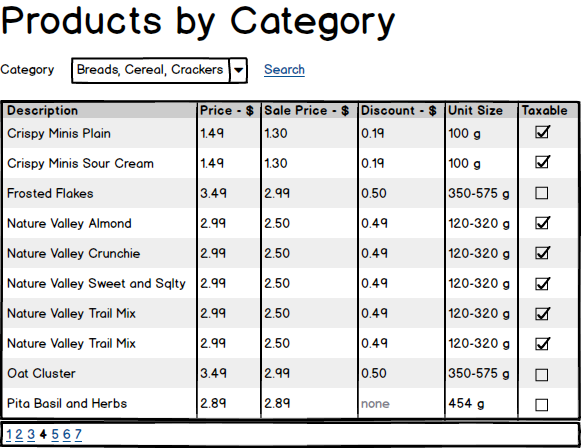
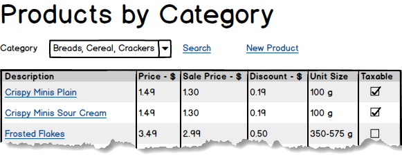
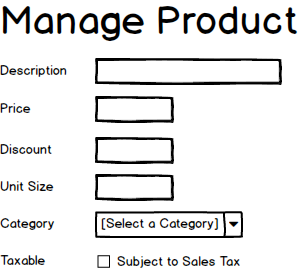

# Query and CRUD Review 

## Marking Rubric 

| Earned  | Marks | Section                           |
| :-----: | :---: | --------------------------------- |
| **TBD** |   2   | Part 1 - Setup                    |
| **TBD** |   3   | Part 2 - Querying Data            |
| **TBD** |   5   | Part 3 - CRUD Maintenance         |
|         | ----- | *Bonus/Penalties (e.g.: commits)* |
| **TBD** |  10   | **Total**                         |

> Your instructor may require you to demonstrate your solution **in class**.

> Be aware that this is the first exercise in a series of cumulative exercises - you must be prepared to complete each exercise in light of the possibility that any given exercise may depend on the correct implementation of previous exercises. Place your work in your assigned repository. Remember to handle your planning and tracking using Milestones and Issues. All commits must have meaningful messages.

----

## Milestones and Issues

In completing this exercise, you are required to plan and track your progress through GitHub Milestones and Issues.

Create a single Milestone named "**Exercise 2 - Query and CRUD Review**" and assign it the due date for this exercise. For this milestone, create several Issues to outline your plan for completing this exercise; each issue must be titled and described appropriately. You are expected to reference these issue numbers when committing your code; you must also close at least one issue via a commit.

**These milestones and issues are expected to be set up within 36 hours of the day that the assignment is released.**

----

## Part 1 - Setup 

Create a client-server application of a single solution (`.sln`) with a Web Application project and a Class Library project (both of them as **.NET Core**).

- The solution folder must
  - Be placed directly under the repository's `src` folder.
  - Contain a `ReadMe.md` file at the root of the solution folder. Use this file to report any **known bugs** in your exercise at the time of submission.
- The Web Application project must:
  - Include *Individual User Accounts* for its *Authentication*.
  - Use a classless stylesheet such as [**HolidayCSS**](https://holidaycss.js.org/) or any other one approved by your instructor.
- The class library must contain the Entity Framework classes for the **GroceryList** database.
  - Generate these by reverse-engineering the database.
  - Ensure the entity and DbContext classes are marked as **`internal`**.

## Part 2 - Querying Data 

> Remember to use appropriate *View Model* classes for exchanging data with the Presentation Layer.

Create a page that will display product data related to a supplied category. This page must be accessible by the site-wide navigational menu.

Categories should be sorted by description and displayed in a drop down; the drop-down must include a prompt option. Display the product data as shown in the mock-up below. Remember to include pagination, allowing 10 items per page.

## Part 3 - CRUD Maintenance 

> Remember to use appropriate *View Model* classes for exchanging data with the Presentation Layer.

Create a web page to perform CRUD maintenance on individual products. Link to this page via the product description on the previous Query page (from Part 2).

When handling the discount percentage, allow the user to enter the value as a whole number, but remember to store it as a straight decimal value. For example, if the user enters `25` as the percent discount, the value to be stored in the corresponding database column is `0.25`.

----

> Remember to ask you instructor if you need any clarification on these specifications. Your instructor is free to modify these specifications.
