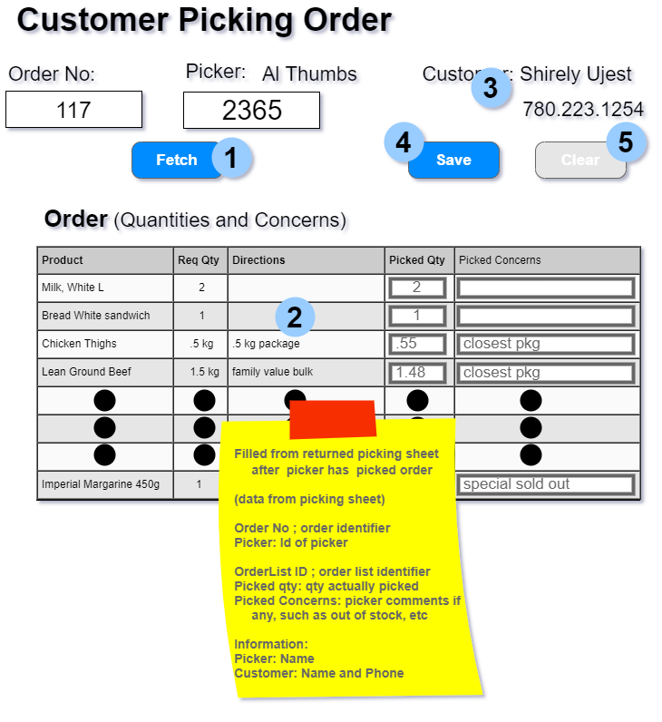
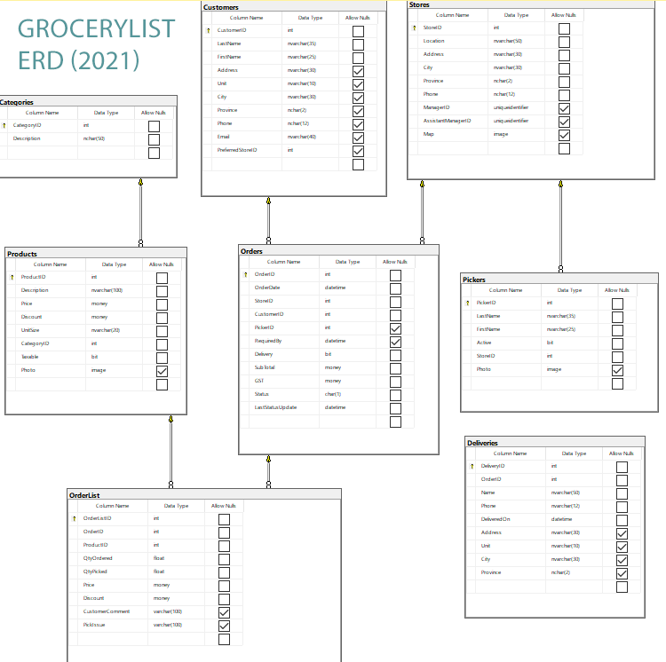

# Entity Framework - Integrated OLTP Exercise (6 marks)

Clone this repository to your machine. Move the /OLTP_Intergrated/scr folder from this specifications repository to your exercise repository. This folder contains the starting solution for this exercise. Open the solution, change the connection string within the appsetting.json to your server. The solution should compile cleanly. There are 3 areas to complete: razor page table to manage data; OnPost event for Save and PickingServices method ProcessPicking. 

A GroceryList dacpac file, at the root of the repository folder, has been included with this exercise. A sql script called NonPickedGroceryData.sql has been supplied so you can repeatedly test against the same data. Simply rerun the script at any time. The Order number is 357 and picker id is 3. The order contains groceries using whole numbers and decimal numbers, taxable and non-taxable, and discounted and non-discounted items. There are 9 items in the order.

Note the following requirements when processing:

Fetch (Done)

- Order number and Picker ID are required

The event uses queries to obtain the picker name; the customer information associated with the order; and a list representing the order items. The order will not be displayed until you have completed the table body on the form.

Save

- Order number and Picker ID are required
- Orders can have multiple items
  - Picked Qty is required for each item.
    - Picked quantity must be greater or equal to 0.
  - Picked Concerns is optional
    - Picked concerns has string or is null.
  - OrderListId is required
    - OrderlistID is a suppressed value on each order item line

This event executes a busines process transaction. You will need to setup the Razor Page table using the classroom demonstrated CQRS binding techniques. The command model class PickedItem describes the table fields to be used for the transaction process. Within the business process transaction you will need to update the item on the OrderList (picked qty, price and discount, any picked issue) and update the Order (picker, last status update (use today's date), subtotal, gst, status (R)).

Comments about rules and validation can also be seen in the PickingServices method.

Clear (Done)

This event will empty all form controls.

